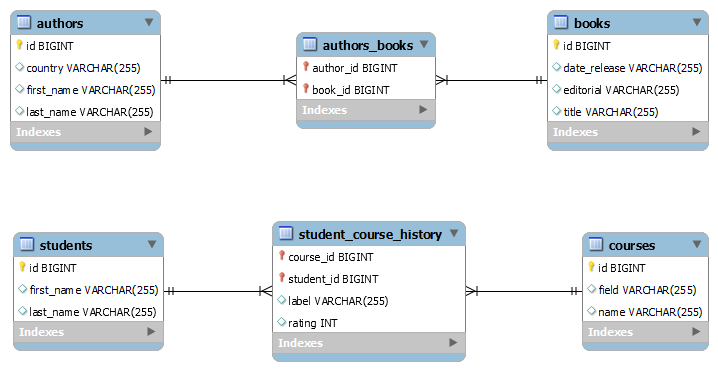

# Spring JPA ManyToMany

Proyecto con implementación de la relacion Many To Many para dos casos: relación simple y con la presencia de otros campos.

Autores-Libros y Estudiantes-Cursos

## Descripción

Para la realización de esta relación se debe usar la anotación @OneToMany, @ManyToOne y @ManyToMany propias de Spring Data JPA.

## Inicio

### Dependencias

* Spring v2.5.6, Spring JPA, MySQL driver, Java 8+.
* Cualquier Sistema Operativo

### Instalación

* Clonar el repositorio
```
git clone https://github.com/Capdoo/spring-jpa-onetomany.git

```

* Crear la Base de Datos usando MySQL
```
CREATE DATABASE compras CHARACTER SET utf8 COLLATE utf8_general_ci;

```


### Editar las propiedades

* Es necesario modificar el archivo application.properties
* Se debe indicar el nombre de usuario y contraseña de la Base de Datos

```
spring.datasource.url=jdbc:mysql://localhost:3306/compras
spring.datasource.username=[Username]
spring.datasource.password=[Contraseña]
spring.datasource.driver-class-name=com.mysql.cj.jdbc.Driver

```

## Anotaciones

### Caso 1

* La creación de la tabla intermedia es automática.
* No es posible añadir otros campos en dicha relación.
```
@ManyToMany
@JoinTable( name = "authors_books", joinColumns = @JoinColumn(name = "author_id"), inverseJoinColumns = @JoinColumn(name = "book_id"))
private Set<BookModel> books;
```
```
@ManyToMany(mappedBy = "books")
Set<AuthorModel> authors;
```

### Caso 2

* Es necesario crear una clase para almacenar la llave implementando la interfaz Serializable
* Es posible tener más campos en la nueva tabla.
```
@OneToMany(mappedBy = "studentModel")
private Set<StudentCourseHistory> history;
```
```
@OneToMany(mappedBy = "courseModel")
Set<StudentCourseHistory> history;
```
* Dentro de la clase que almacena Key.
```
@Column(name = "student_id")
Long studentId;

@Column(name = "course_id")
Long courseId;
```
* Dentro de la clase que define la nueva relación.
```
@EmbeddedId
StudentCourseKey id;

@ManyToOne
@MapsId("studentId")
@JoinColumn(name = "student_id")
StudentModel studentModel;

@ManyToOne
@MapsId("courseId")
@JoinColumn(name = "course_id")
CourseModel courseModel;

Integer rating;
```

## Relación


## Authors

Contribuidores y enlaces

[@Capdoo](https://github.com/Capdoo)


## License

This project is licensed under the MIT License.

## Acknowledgments

El fundamento de ManyToMany en Spring JPA.
* [Spring Many To Many - Baeldung](https://www.baeldung.com/jpa-many-to-many)
